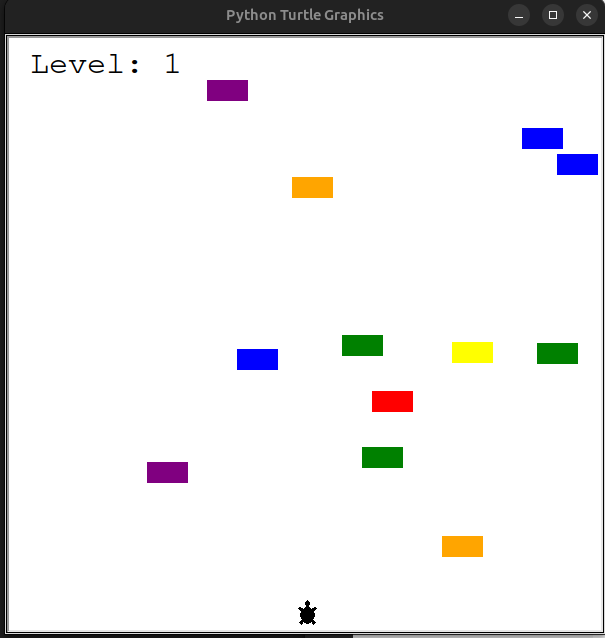

# Turtle Crossing Game 🐢



A classic Frogger-style game built with Python Turtle graphics where a turtle must cross a busy road!

## 📁 Files

- `main.py` - Main game loop and setup
- `player.py` - Player turtle movement
- `car_manager.py` - Car creation and movement
- `scoreboard.py` - Score and level display

## 🎮 How to Play

1. Control the turtle with **Up Arrow** key
2. Cross the road without hitting cars
3. Reach the top to advance to next level
4. Game speeds up each level
5. Game ends if hit by a car

## ✨ Features

- **Increasing Difficulty**: Cars move faster each level
- **Score Tracking**: Current level displayed
- **Random Car Generation**: Random colors and positions
- **Collision Detection**: Game ends on impact
- **Smooth Animation**: Using turtle tracer()

## 🎯 Game Objects

### Player
- Starts at bottom of screen
- Moves upward only
- Resets at top for new level

### Cars
- Random colors: red, orange, yellow, green, blue, purple
- Random Y positions (-230 to 250)
- Move from right to left
- Speed increases with level

### Scoreboard
- Displays current level
- Shows "Game Over" message

## 🚀 Quick Start

```bash
python main.py
```


